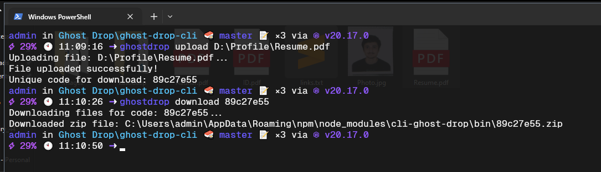

# Ghost Drop CLI

Ghost Drop is a file-handling service that allows users to securely upload and download files using unique codes.
The CLI tools provides an easy-to-use interface to interact with the Ghost Drop server.

## Features

- **Secure Uploads**: Upload files to the Ghost Drop server and retrieve a unique code for download.
- **Secure Downloads**: Download files associated with a unique code as a ZIP archive.
- **Encryption Support**: Files are encrypted for secure storage and decrypted when downloaded.
- **Multiple Files**: Supports uploading and downloading multiple files at once.
- **Command-Line Interface**: Easily interact with the service directly from the terminal.
- **Cross-Platform**: Works on any platform where Node.js is installed.

## Demo



## Installation

You can install the Ghost Drop CLI globally via npm:

```bash
npm install -g cli-ghost-drop
```

Once installed, you can verify the installation by running:

```bash
ghostdrop --help
```

## Usage

### Upload Files

To upload a file and get a unique code, use the `upload` command:

```bash
ghostdrop upload <file_path>
```

Example:

```bash
ghostdrop upload ./myfile.txt
```

After a successful upload, the CLI will output a unique code that can be used to download the file.

### Download Files

To download files associated with a unique code, use the `download` command:

```bash
ghostdrop download <unique_code>
```

Example:

```bash
ghostdrop download abc123
```

This will download the files as a ZIP archive.

### Help Command

You can always see the available commands and options by running:

```bash
ghostdrop --help
```

### Available Commands

- `upload <file>`: Uploads a file to Ghost Drop and retrieves a unique code.
- `download <code>`: Downloads files associated with a unique code as a ZIP archive.
- `--help`: Shows help information for available commands.

## Contributions

Contributions are welcome! To contribute:

1. Fork the repository.
2. Create a new branch for your feature or bugfix.
3. Submit a pull request.

### Ghost Drop Server Features

This CLI interacts with the Ghost Drop server, which has the following features:

- **Automatic Expiry**: Uploaded files have a configurable expiry time, ensuring data is not stored indefinitely.
- **Encryption**: Files are encrypted before storage, and decrypted upon download for added security.
- **Multithreaded Uploads**: Supports multithreaded uploads to speed up the process.
- **Cron Jobs for Cleanup**: Scheduled jobs clean up expired files and data.
- **Future Integrations**: Planned integrations include AWS S3 for cloud storage support.

---

## Contact

For support or inquiries, please reach out via [GitHub Issues](https://github.com/kasodeep/ghost-drop/issues).
